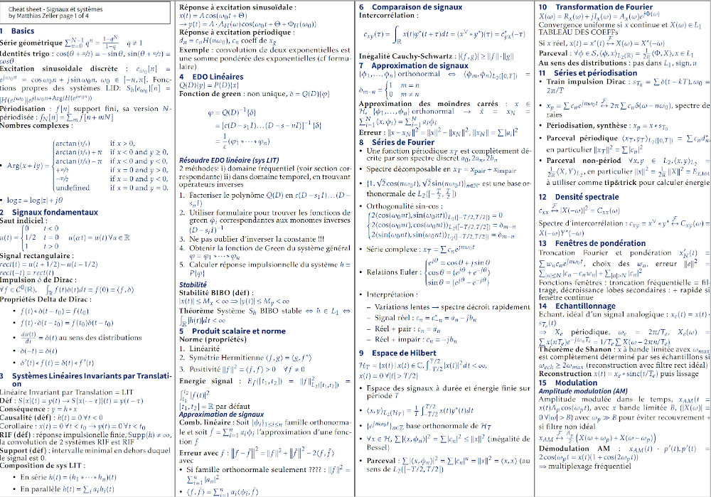
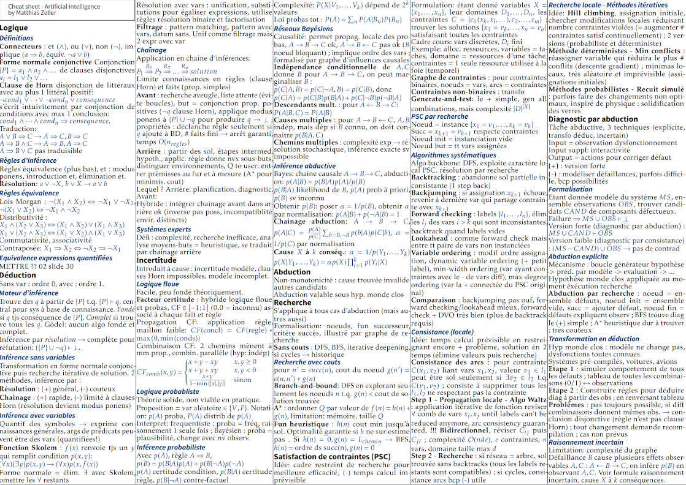
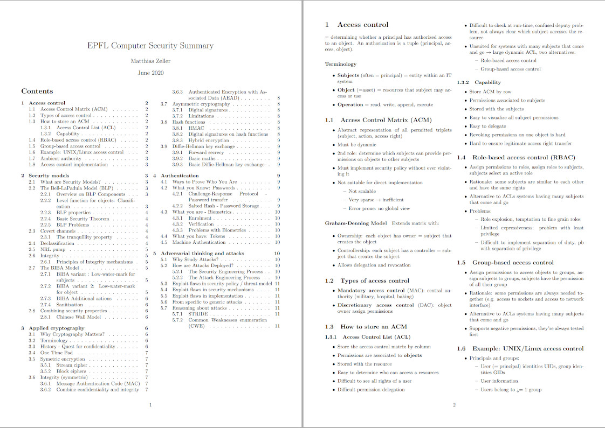

# docs-companion

**Short description**: Gather latex templates for reports, course summaries, and cheatsheets. Overleaf bridge.

## Motivation 

[Overleaf website](https://www.overleaf.com/) (cloud-based LaTeX editor) recently added a feature to classify projects by named and colored categories.
Until now, overleaf projects accumulated without well-defined structure. This new feature gave me the idea to create an 
overleaf-github bridge, in order to **centralize and backup** latex templates. 

## Example templates

#### Cheatsheets

&nbsp;&nbsp;&nbsp;&nbsp;

#### Summaries



## Project structure


### Bridge principles

* 1 GitHub repo linked with 1 Overleaf project
* Default view: README.md and main.tex
* File browser in both interfaces

#### Add templates to this repo

From Overleaf perspective, it is currently not possible to 
include all files of an external project (only a single file at a time can 
be uploaded). Best solution I found so far: download `.zip` files of 
projects from Overleaf, and unzip them in corresponding category.


### File structure

* Directory tree level 1 (i.e. root) : 
  * Name of template categories (e.g. cheatsheets)
  * Git README.md
  * main.tex
* Directory tree level 2  : 
  * specific example projects / templates 

#### Treeview of template structure

```
.
├── cheatsheets
│   ├── proj-cheatsheet-1
│   │   ├── foo.tex
│   │   ├── main.tex
│   │   ├── README.txt
│   ├── proj-cheatsheet-2
│   │   ├── main.tex
│   │   └── ...
│   └── ...
├── main.tex
├── overleaf-original
│   ├── project-1.zip
│   └── ...
└── summaries
    └── topic1
        └── ...
```

## To-have-on-hand commands 

### Generate PDF vignette for example projects READMEs

* PDF to SVG:
  ```bash
  $ inkscape --without-gui --file=input.pdf --export-plain-svg=output.svg
  ```


<!-- Add HTML break lines to improve markdown real-time visualization in PyCharm  -->
<br /><br /><br /><br /><br /> 
