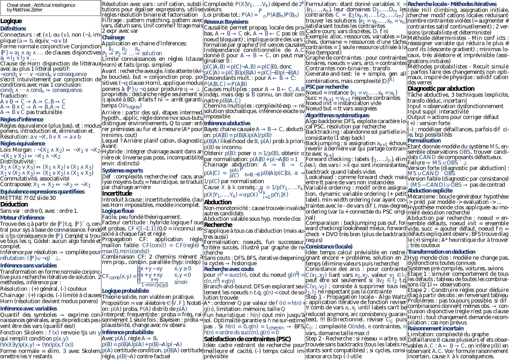

# AI Cheatsheet (French)

Template found on link:
https://stackoverflow.com/questions/1911516/how-to-make-cheat-sheets-in-latex

Based on EPFL course *[Intelligence Artificielle, CS-330](https://edu.epfl.ch/coursebook/fr/intelligence-artificielle-CS-330)*.

## PDF Thumbnail

<!--- Render SVG in Github Markdown 
      https://stackoverflow.com/questions/13808020/include-an-svg-hosted-on-github-in-markdown -->

